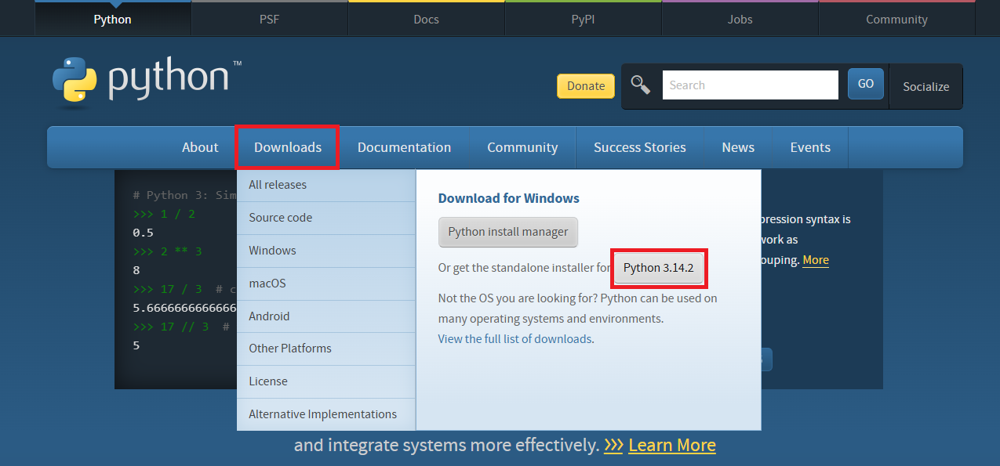
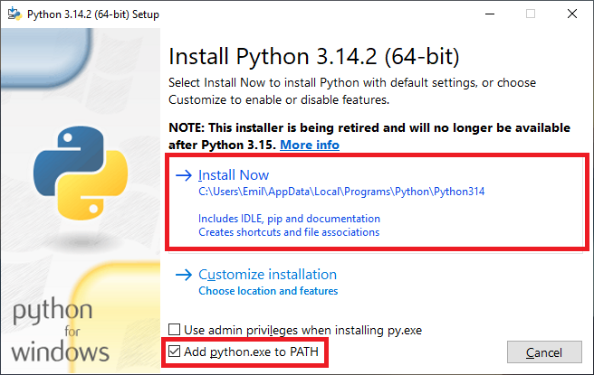
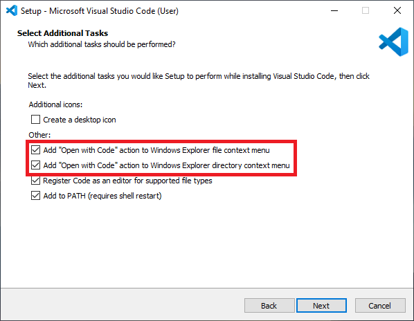
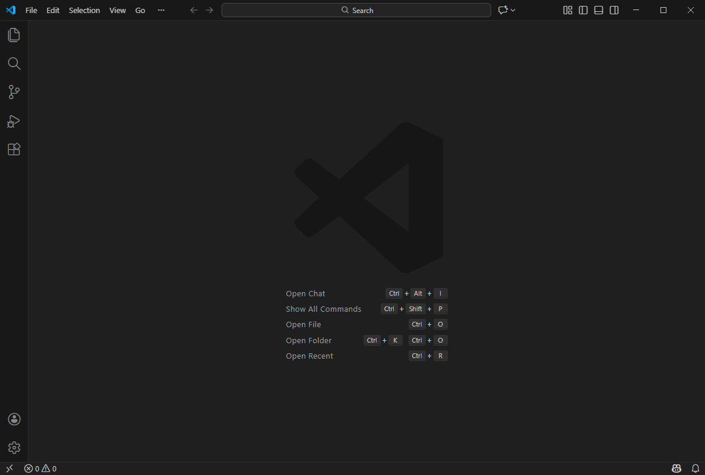
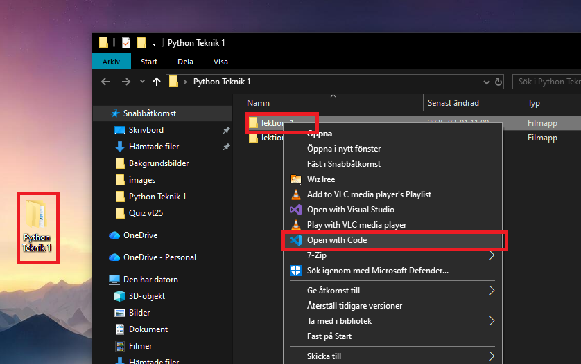
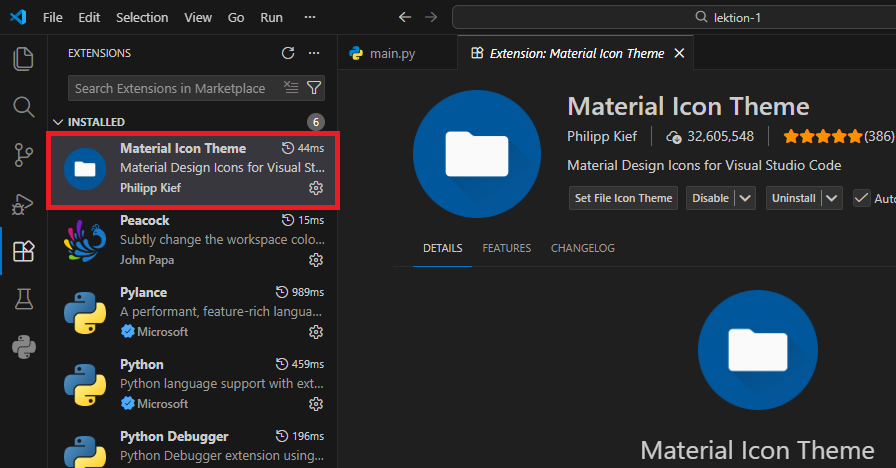

# Lektion 1

## Installera Python
Gå till https://www.python.org/, ladda ner och installera senaste versionen.



Under installationen, välj add to PATH. I övrigt acceptera allt. :)



När du är färdig kan du kontrollera att allt gått bra genom att öppna Kommandotolken/Terminal/Powershell på din dator och skriva:

```bash
python --version
# Python 3.14.0
```
> Det här kan du också göra om du redan har python installerat för att kolla vilken version du har.

??? warning "Om `python --version` inte funkar"
    Testa istället: `py --version`. 

    I Windows kan kommandot `python` ibland vara kopplat till Microsoft Store i stället för din installerade Python.
 


## Installera VS code
Gå till https://code.visualstudio.com/ och tryck på den stora feta knappen "Download for Windows", starta sedan installationen genom att köra den nedladdade filen.

Under installationen lägg till funktion för högerklick. Notera, här kan du också markera "desktop icon" om du vill ha en ikon på skrivbordet för att starta programmet.


När du är färdig och programmet är igång möts du av nån slags "komma igång" guide och en ruta där de vill att du ska använda deras AI. Dessa kan med fördel stängas ned.


Vilket resulterar i följande vy. Glorious.


## Öppna mapp i VS Code
Mitt förslag är att göra en mapp någonstans på datorn som heter t.ex. "Python Teknik 1", inne i den gör vi sen en ny undermapp för varje lektion, "lektion-1", "lektion-2" osv.

Det finns olika sätt att öppna mappar i VS Code. Jag demonstrerar här att högerklicka på mappen och välja "Öppna i VSCode".


> Alternativt, inne i VS Code, välj File --> Open Folder --> Hitta och öppna din mapp.


## Lägg till fil
Nu är mappen på datorn öppen i VSCode, man kan se att den inbyggda filhanteraren har fällt ut sig, uppe till vänster, och vi kan se mappnamnet "lektion-1".

Lägg till en fil genom att klicka på "add file", namnge filen "main.py". Det viktiga här är filändelsen, alltså ".py".


> Notera att det här skapar en fil som "finns på datorn" på riktigt, tittar man i mappen i windows utforskare kan man se den nya filen. 

## Python Extension i VS Code
VS Code är i grunden ett textredigeringsprogram, och på grund av programmets popularitet finns det många extra funktioner via tillägg, extensions, precis som det kan finnas tillägg i en vanlig webbläsare.

För att kunna smidigt köra kod i Python installerar vi tillägget "Python" från Microsoft. Öppna tabben "Extensions" till vänster och sök på "Python. Och ja, det finns två knappar för att installera, välj vilken som.


### Bling

Det finns många olika extensions, en annan rekommendation är ju ett icon-theme, så att dina ikoner ser bättre ut, eller varför inte ett tema som ändrar utseendet på hela programmet? 

Personligen kör jag ofta "Material Icon Theme" för jag ser tydligare skillnad på ikonerna ute till vänster, t.ex. för mappar och filer main.py.



## Kolla att VS Code använder rätt python
VS Code kan köra olika versioner av python, om du bara har en version bör det inte vara några problem, när du är i filen main.py, kontrollera att det står något i stil med python 3.x nere till höger.


Om det INTE står Python 3.x

- Öppna Command Palette: Ctrl+Shift+P
- Välj Python: Select Interpreter
- Välj Python 3.x


## Skriv och kör koden
Det finns massa olika saker man kan skriva såklart. Börja med att använda funktionen print(), som finns inbyggd i python för att få ut information från programmet ut i konsollen.

```py
print("Hello, world!")
```

För att köra programmet kan man klicka på den lilla triangulära "kör"-knappen uppe till höger, utmatad information dyker upp i ett terminalfönster längst ner i programmet.


## Variabler och kommentarer
En variabel är som en låda som kan lagra ett värde. Jämför med variabler i matematiken, där variabeln x kan vara lika med värdet 5.

Variabler är ett bra sätt att lagra information i programmet, och kan sedan ändras av programmet självt under dess körtid.

Variabler ska namnges på ett beskrivande sätt. Det är enklare att förstå vad variabeln "meddelande" innehåller än om man gett variabeln namnet "sdf_2".

Utöver detta ska variabler också namnges enligt "snake_case", om en variabel består av fler än ett ord, koppla ihop med understreck. Enbart små bokstäver.

```py
meddelande = "Hej igen!"
print(meddelande)
```
Kommentarer är rader med kod som inte exekveras, alltså körs av pythons interpreter. Kommentarer är bra för att förklara vad kod gör eller övrig information som någon som läser din kod behöver veta.

```py
# Det här är en kommentar
print("Hej!")
# print("Nej")
```


## Input
Om print() är sättet som programmet skickar ut information så kan input() användas för att ta in information från användaren.

Följande exempel låter användaren skriva sitt namn, sparar namnet i en variabel och skriver sedan ut namnet igen.
```py
name = input("Skriv ditt namn: ")
print("Hej", name)
```

Det går också bra att skriva ut flera variabler via samma print().
```py
namn = "Arne"
ålder = 99
print("Hej", namn, "du är", ålder, "år.")
```


## Omvandla till tal
Ibland behöver man få in information i form av siffror, till det kan man använda float().

```py
# Tar in en text som ska bli tal, här ska ju då anv skriva t.ex. 34
text = input("Skriv in ett tal:")

# Gör om texten till ett tal mha float()
tal = float(text)

# Skriver ut tal + 5, alltså 39.
print(tal + 5)
```
Man kan också använda float() och input() på samma rad om man föredrar det:
```py
# Här sparas en siffra i variabeln tal, som vi får från float(), 
# som i sin tur fått text från input().

tal = float(input("Skriv in ett tal:"))
```
> Notera, när du skriver decimaltal använd punkt istället för komma.


??? info "Vadå float?"
    I Python har värden olika **datatyper**, även om det inte syns. En datatyp beskriver vilken sorts värde det är och vad man kan göra med det. 
    
    Exempelvis för siffror finns bl.a:

    - `int` = **heltal** (utan decimaler), t.ex. `3`, `-12`, `0`
    - `float` = **decimaltal** (representeras med decimalpunkt), t.ex. `3.5`, `0.25`, `-1.0`

    Man kan undersöka vilken datatyp ett värde har med funktionen type(). Exempelvis print(type(5)) kommer skriva ut att det är en "int".


## Avrundning
Ett sätt att undvika fula decimalutvecklingar är att avrunda med round(). Funktionen tar två argument, först talet som ska avrundas, sen hur många decimaler man vill ha.

```py
tal = 1/3
print(tal)
# 0.33333333333

# Avrundar till 2 decimaler, sen print
print(round(tal,2))
# 0.33
```


## Uppgift 1
Du ska skriva ett program och lämna in via classroom. Du ska lämna in en fil som heter main.py. Överst i filen ska du skriva följande info:

```py
# Namn: XXXX YYYY
# Klass: NATE25
```

Ditt program ska:

- Fråga efter användarens namn.
- Fråga efter en hastighet i km/h.
- Räkna om hastigheten till m/s och avrunda svaret till 2 decimaler.
- Skriva ut ett meddelande som innehåller både namnet och den omvandlade hastigheten.


Såhär skulle det kunna se ut när man kör programmet. Jag har markerat situationer där användaren skriver in information med ett olikhetstecken, > TEXT.

```
Hej vad heter du? > Emil
Vad trevligt, hur fort kör du? Svara i km/h: > 50
Härligt Emil, du uppnår hela 13.89 m/s! 
```
> Din text kan självklart vara annorlunda, men få med namn och hastigheten i m/s.


Lämna in genom att ladda upp din main.py fil i inlämningen i classroom.


