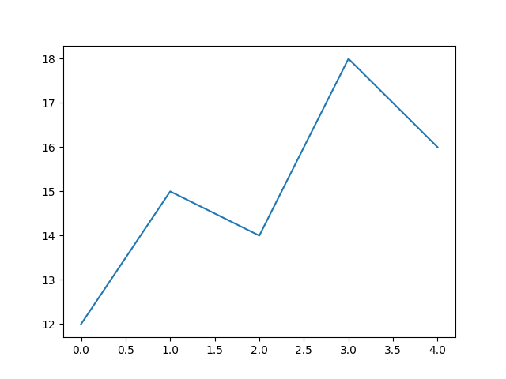
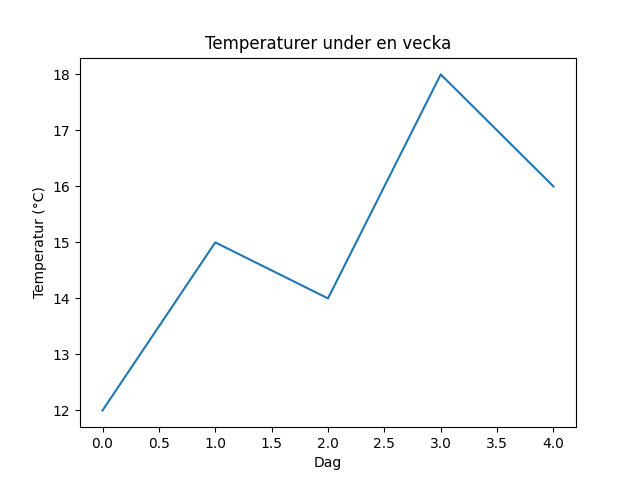
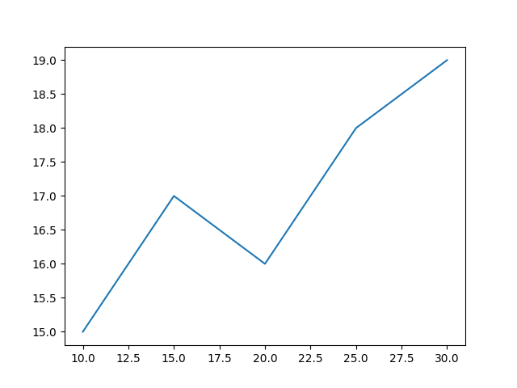
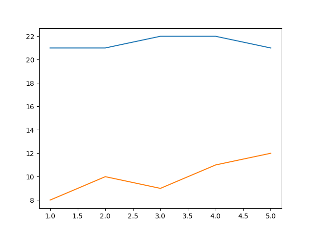
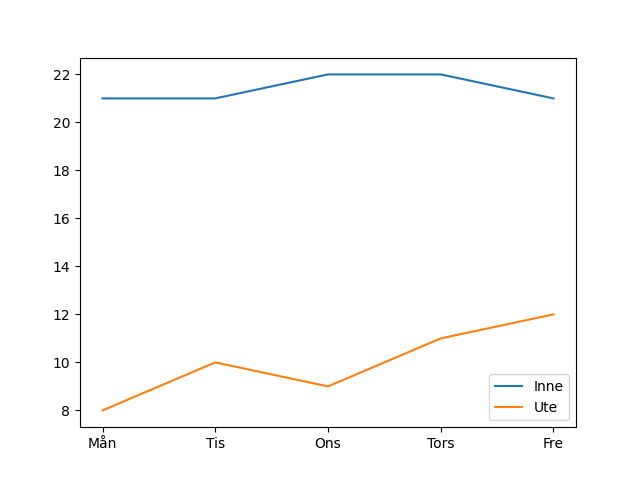
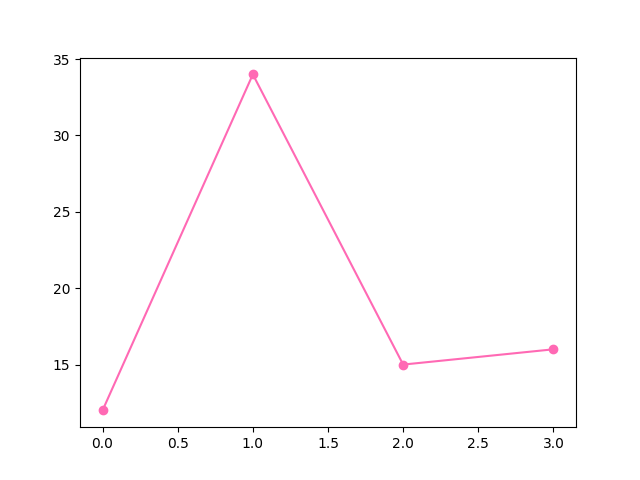
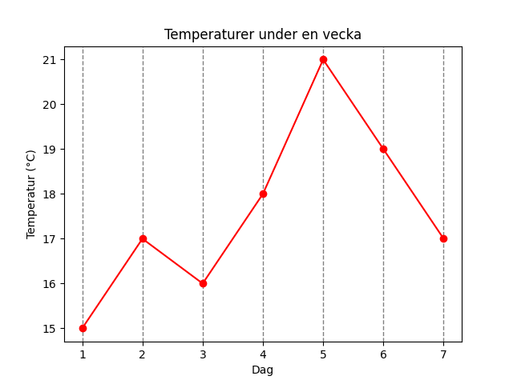
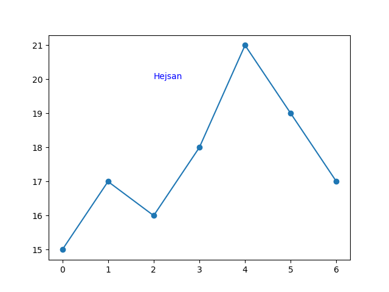
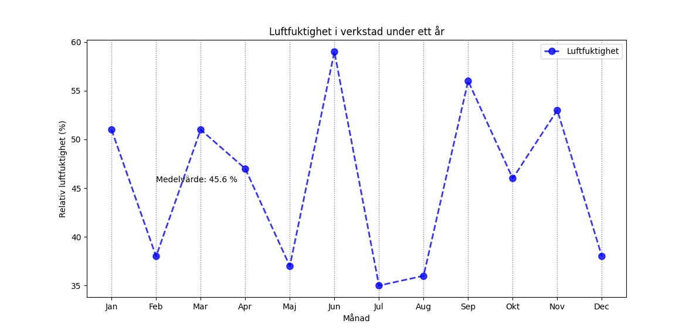

# Lektion 5
En styrka med Python är att det finns många olika resurser som man kan importera och använda.

Här används modulen `random` för att få fram slumpade tal och biblioteket `matplotlib` för att rita grafer. `matplotlib` behöver installeras, men `random` finns redan i Python från början

## Installera matplotlib
Kör följande kommando i din Terminal-app, precis som när du installerade python från början.

```bash
python -m pip install -U matplotlib
```

Valfritt, kontroll, om man har framgångsrikt installerat biblioteket kan man se det tillgängligt via följande kommando i kommandotolken.

??? info "Om du vill kontrollera"
    Om du vill kolla att installationen fungerande kan man exempelvis lista alla moduler man har installerade via:

    ```bash
    python -m pip list
    ```

    Eller använda kommandot show för att visa bara matplotlib:

    ```bash
    python -m pip show matplotlib
    ```


## Introduktion till matplotlib
Kommer främst fokusera på linjediagram, går även att rita andra diagram.

### Ditt första diagram
För att matplotlib ska fungera behöver man i sin källkod importera biblioteket, via import.

Matplotlib ritar ut data från listor.
```py
import matplotlib.pyplot as plt # Denna rad behövs!

lista = [12, 15, 14, 18, 16]
plt.plot(lista)
plt.show()
```



### Titel och etiketter
Man kan lägga till titel och axelrubriker via title, xlabel och ylabel, notera att `plt.show()` ska vara sist.
```py
plt.plot(lista)
plt.title("Temperaturer under en vecka")
plt.xlabel("Dag")
plt.ylabel("Temperatur (°C)")
plt.show()
```


### Ändra x-axeln
Det går att fixa x-axeln genom att skicka in en egen lista för den, nu blir exempelvis x-värdet 30 motsvarande y-värdet 19.
```py
x_axel = [10, 15, 20, 25, 30]
temperaturer = [15, 17, 16, 18, 19]

plt.plot(x_axel, temperaturer)
plt.show()
```
> Det går också att skicka in en lista med text, t.ex. mån, tis, ons...




### Flera grafer i samma diagram
Det går bra att rita ut flera grafer i samma plot.
```py
dagar = [1, 2, 3, 4, 5]
inne = [21, 21, 22, 22, 21]
ute = [8, 10, 9, 11, 12]

plt.plot(dagar, inne)
plt.plot(dagar, ute)
plt.show()
```


### Förklaringar
Om man gör det kanske man vill skriva ut förklaringar, det görs med hjälp av `label` och `legend()`.
```py
dagar = ["Mån", "Tis", "Ons", "Tors", "Fre"]
inne = [21, 21, 22, 22, 21]
ute = [8, 10, 9, 11, 12]

plt.plot(dagar, inne, label="Inne")
plt.plot(dagar, ute, label="Ute")
plt.legend()
plt.show()
```


## Färger och stil
Det finns många färg och stilalternativ för att ändra utseendet på grafen.

Exempelvis linjefärg och markering för datapunkterna:
```py
temperaturer = [12, 34, 15, 16]
plt.plot(temperaturer, color="hotpink", marker="o")
plt.show()
```


Matplotlib stödjer massa färger på flera olika sätt, man kan scrolla ner lite här och se en lista.
https://matplotlib.org/stable/gallery/color/named_colors.html

Det finns även galet många olika markers man kan använda, se lista på matplotlibs hemsida:
https://matplotlib.org/stable/api/markers_api.html

??? info "Fler argument till plot()"
    Bonus, finns massa fler argument till plot(), se exempel:
    ```py
    dagar = [1, 2, 3, 4, 5, 6, 7]
    temperaturer = [15, 17, 16, 18, 21, 19, 17]

    plt.plot(
        dagar,
        temperaturer,
        color="red",
        marker="o",
        linestyle="--",
        linewidth=5,
        markersize=20,
        label="Temperatur",
        alpha=0.3
    )

    plt.title("Temperaturer under en vecka")
    plt.xlabel("Dag")
    plt.ylabel("Temperatur (°C)")
    plt.legend()
    plt.show()
    ```

### Ändra rutnätet med grid()
Funktionen grid() kan användas för att ändra hur rutnätet bakom grafen ser ut.
```py
dagar = [1, 2, 3, 4, 5, 6, 7]
temperaturer = [15, 17, 16, 18, 21, 19, 17]

plt.plot(dagar, temperaturer, color="red", marker="o")
plt.title("Temperaturer under en vecka")
plt.xlabel("Dag")
plt.ylabel("Temperatur (°C)")
plt.grid(axis="x", color="gray", linestyle="--", linewidth=1)
plt.show()
```


## Skriv text i diagrammet
Man kan skriva text i diagramytan med hjälp av funktionen text(), enligt: `plt.text(x, y, "din text")`.

Nedanstående exempel skriver ut texten "Hejsan" med start på punkten (2,20) i koordinatsystemet.
```py
temperaturer = [15, 17, 16, 18, 21, 19, 17]

plt.plot(temperaturer, marker="o")
plt.text(2, 20, "Hejsan", color="blue")
plt.show()
```



??? tip "Peka ut en punkt med `annotate()`"
    Om du vill markera en viss punkt i grafen kan du använda `annotate()`.

    `annotate()` liknar `text()`, men kan också rita en pil till en punkt.

    ```python
    import matplotlib.pyplot as plt

    temperaturer = [15, 17, 16, 18, 21, 19, 17]

    plt.plot(temperaturer, marker="o")
    plt.title("Temperaturer under en vecka")
    plt.xlabel("Dag")
    plt.ylabel("Temperatur (°C)")
    plt.grid()

    plt.annotate(
        "Högsta värdet",
        xy=(4, 21),
        xytext=(2, 22),
        arrowprops=dict(arrowstyle="->")
    )

    plt.show()
    ```

    Förklaring:
    
    - `xy=(4, 21)` är punkten vi vill peka ut
    - `xytext=(2, 22)` är platsen där texten ska stå
    - `arrowprops=...` gör att en pil ritas mellan texten och punkten


## Övrigt
### Andra diagramtyper
`plt.plot()` används för linjediagram.

Det finns också andra typer av diagram i matplotlib, till exempel:

- `plt.bar()` för stapeldiagram
- `plt.scatter()` för punktdiagram
- `plt.hist()` för histogram

### Resurser
Det finns väldigt mycket man kan göra med matplotlib, och det här avsnittet täcker inte i närheten av allt, tips på mer läsning:

- Officiell dokumentation, https://matplotlib.org/stable/
- Guide på W3C, https://www.w3schools.com/python/matplotlib_intro.asp


## Slumptal
Om man vill generera lite slumpade tal som man kan rita ut i sin graf.

Behöver importera modulen random, högst upp i källkoden, precis som för matplotlib tidigare.
```py
import random
```

### Slumpa ett tal
Kan göras med randint(), tänk "random integer", alltså "slumpat heltal".
```py
slumpat_tal = random.randint(1, 6)
print(slumpat_tal)
```
> Kan ge 1, 2, 3, 4, 5 eller 6. Ja, 6 räknas med här, till skillnad från range().

### Fyll en lista med slumpade tal
Använder en loop för att fylla en lista med slumpade tal, varje varv i loopen läggs ett tal till på listan.

```py
lista = []

for i in range(10):
    slumpat_tal = random.randint(10, 30)
    lista.append(slumpat_tal)

print(lista)
```
> Ger utskrift av en lista med 10 st slumpade tal mellan 10 och 30.

### Random bonus

## Inlämning 5
Du ska skriva ett program och lämna in via classroom. Du ska lämna in en fil som heter `förnamn_efternamn_inl_5.py`. Överst i filen ska du skriva följande info:

Överst i filen ska du skriva följande info:
```py
# Namn: XXXX YYYY
# Klass: NATE25
```

Programmet ska simulera den relativa luftfuktigheten i en verkstad, uppmätt en gång i månaden under ett år. Luftfuktigheten kan variera mellan 30 och 60 %.

Ditt program ska:

- Skapa en lista med 12 slumpade mätvärden, heltal, mellan 30 och 60.

- Rita ut en graf baserat på den slumpade mätdatan. 
    - Grafen ska ha en x-axel med årets månader. 
    - Grafen ska ha axelrubriker och titel.
    - Grafen ska vara snygg (alltså du ska formatera grafen lite som du känner för). 

- Beräkna och skriva ut, på bilden, den genomsnittliga luftfuktigheten. Alltså medelvärdet. 
  
    *Notera att medelvärdet ska skrivas ut på rätt höjd, om medelvärdet är 40, så ska också texten vara på y-koordinat 40.*


Stilkrav:

- Använd beskrivande variabelnamn, t.ex. `temperaturer`, `antal_ogiltiga`, `minsta`, `storsta`.
- Ha minst en beskrivande kommentar som delar upp/förtydligar vad som händer, exempelvis # Rimlighetskontroll

### Testkörning

Såhär skulle det kunna se ut när man kör programmet, dina formuleringar kan självklart vara annorlunda.


